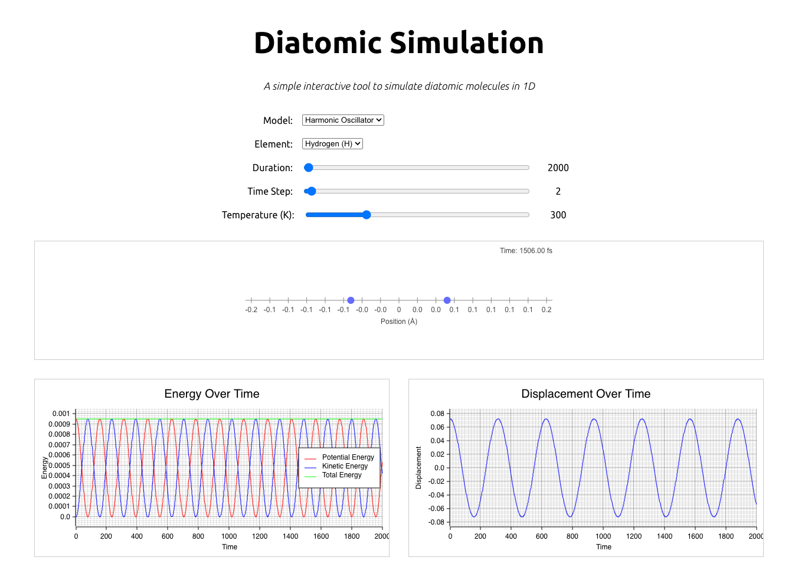

# Interactive Diatomic Molecule Simulation (Web Widget in with Rust Wasm)
**Author:** Haig Bishop

**Date:** 24-03-2025

---

### Project Overview

This project is a web-based interactive simulation of a 1D diatomic molecule. It allows users to explore the dynamics of molecular vibrations under different potential energy models and for various elements. The simulation is built using Rust for the computational backend, compiled to WebAssembly, and TypeScript for the frontend user interface.



---

### Try the following:

1.  Select the **Lennard-Jones Model** from the "Model" dropdown.
2.  Increase the **Duration** slider to a high value (e.g. 300,000)
3.  Experiment with the **Temperature** slider. 

Observe that as you increase the temperature above a certain threshold, the atoms will only move further and further apart from each other, dissociating completely. This demonstrates the temperature-dependent behavior of the Lennard-Jones potential, where high temperatures can overcome the attractive forces between atoms.

---


## How to Build and Run

### Prerequisites

1.  **Install Node.js and npm:**
    -   Go to the official Node.js website: [https://nodejs.org/](https://nodejs.org/) and download the installer for your OS.
    -   Verify the installation:
        ```bash
        node -v
        npm -v
        ```

2.  **Install Rust and wasm-pack:**
    -   Install Rust by following the instructions on the official Rust website: [https://www.rust-lang.org/tools/install](https://www.rust-lang.org/tools/install).
    -   For most Unix-like systems (Linux, macOS), you can install Rust by running the following command in your terminal:
        ```bash
        curl --proto '=https' --tlsv1.2 -sSf https://sh.rustup.rs | sh
        ```
        For Windows, download and run the `rustup-init.exe` installer from the Rust website.
    -   Then install `wasm-pack`, a tool for using WebAssembly in Rust:
        ```bash
        cargo install wasm-pack
        ```
    -   Verify the installation of `wasm-pack`:
        ```bash
        wasm-pack --version
        ```

### Building and Running the Project

1.  **Clone the project repository:**
    -   Clone the repo and enter the root directory:
        ```bash
        git clone https://github.com/HaigBishop/diatomic-molecule-simulation-widget.git
        cd diatomic-molecule-simulation-widget
        ```

2.  **Install npm dependencies:**
    -   Install the required npm packages (e.g. Vite):
        ```bash
        npm install
        ```

3.  **Build the Rust WebAssembly module:**
    -   You can build the Rust code into a WebAssembly module using the npm script defined in `package.json`:
        ```bash
        npm run build-wasm
        ```
        This command compiles the Rust code to WebAssembly and places the output files in the `public/wasm` dir.

4.  **Start the development server:**
    -   To start the Vite development server:
        ```bash
        npm run dev
        ```

5.  **Open in your browser:**
    -   Open your web browser and go to the URL provided by Vite (e.g., `http://localhost:5173/`). You should see the Diatomic Molecule Simulation running in your browser.

### Building and Running with a Single Command

For convenience, you can use the `npm run start` command (set up in the `package.json` file) to run both steps 3 and 4 at once:
```bash
npm run start
```


### Useful Resources

 - https://plotters-rs.github.io/wasm-demo/www/index.html
 - https://crates.io/crates/plotters
 - https://github.com/plotters-rs/plotters
 - https://github.com/plotters-rs/plotters/blob/a212c30a17f0c44f683b44adb096bba3bae21ae5/README.md
